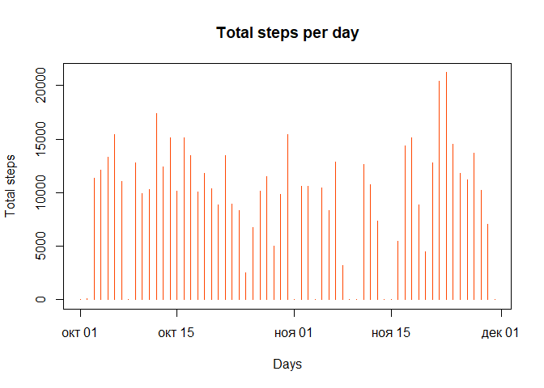
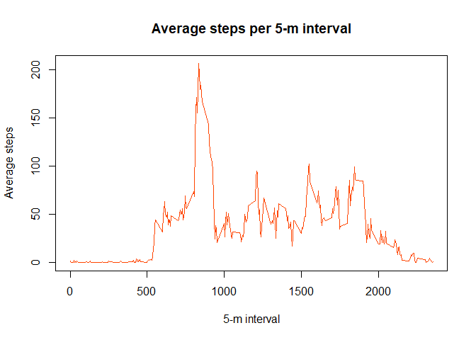
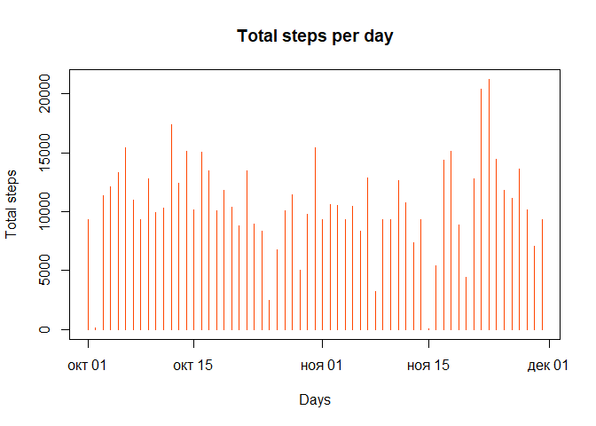
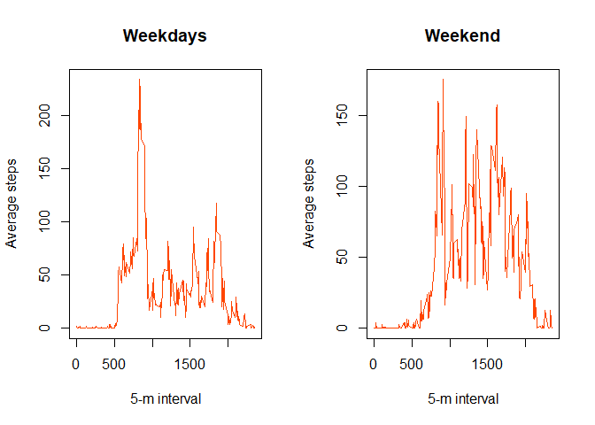

# Reproducible Research: Peer Assessment 1


```r
library(readr)
library(dplyr)
```

```
## 
## Attaching package: 'dplyr'
```

```
## The following objects are masked from 'package:stats':
## 
##     filter, lag
```

```
## The following objects are masked from 'package:base':
## 
##     intersect, setdiff, setequal, union
```

## 1. Loading and preprocessing the data 


```r
activity <- read_csv("C:/Users/dumenko/Desktop/rprog3/as1/activity.csv", col_types = cols(date = col_date(format = "%Y-%m-%d")),na = "NA")
head(activity,10)
```

```
## # A tibble: 10 x 3
##    steps       date interval
##    <int>     <date>    <int>
##  1    NA 2012-10-01        0
##  2    NA 2012-10-01        5
##  3    NA 2012-10-01       10
##  4    NA 2012-10-01       15
##  5    NA 2012-10-01       20
##  6    NA 2012-10-01       25
##  7    NA 2012-10-01       30
##  8    NA 2012-10-01       35
##  9    NA 2012-10-01       40
## 10    NA 2012-10-01       45
```

## 2. What is mean total number of steps taken per day?

Make a histogram of the total number of steps taken each day.


```r
by_day <- group_by(activity, date)
by_day <- summarise(by_day, total_steps = sum(steps,na.rm = T))
head(by_day,10)
```

```
## # A tibble: 10 x 2
##          date total_steps
##        <date>       <int>
##  1 2012-10-01           0
##  2 2012-10-02         126
##  3 2012-10-03       11352
##  4 2012-10-04       12116
##  5 2012-10-05       13294
##  6 2012-10-06       15420
##  7 2012-10-07       11015
##  8 2012-10-08           0
##  9 2012-10-09       12811
## 10 2012-10-10        9900
```

```r
with(by_day,plot(total_steps~date,type='h',xlab = "Days",ylab = "Total steps",main = "Total steps per day", col = "orangered"))
```

<!-- -->

Calculate and report the mean and median total number of steps taken per day.

```r
mean_StepsPerDay <- mean(by_day$total_steps)
mean_StepsPerDay
```

```
## [1] 9354.23
```


```r
median_StepsPerDay <- median(by_day$total_steps)
median_StepsPerDay
```

```
## [1] 10395
```

## 3. What is the average daily activity pattern?

Make a time series plot of the 5-minute interval (x-axis) and the average number of steps taken, averaged across all days (y-axis).


```r
by_interval <- group_by(activity, interval)
by_interval <- summarise(by_interval,avg_steps=mean(steps,na.rm = T))
head(by_interval,10)
```

```
## # A tibble: 10 x 2
##    interval avg_steps
##       <int>     <dbl>
##  1        0 1.7169811
##  2        5 0.3396226
##  3       10 0.1320755
##  4       15 0.1509434
##  5       20 0.0754717
##  6       25 2.0943396
##  7       30 0.5283019
##  8       35 0.8679245
##  9       40 0.0000000
## 10       45 1.4716981
```


```r
with(by_interval,plot(avg_steps~interval,type='l',xlab = "5-m interval",ylab = "Average steps",main = "Average steps per 5-m interval", col = "orangered"))
```

<!-- -->

### Which 5-minute interval, on average across all the days in the dataset, contains the maximum number of steps?

```r
max_interval <- filter(by_interval, avg_steps==max(avg_steps))$interval 
max_interval
```

```
## [1] 835
```

## 4. Imputing missing values

Calculate and report the total number of missing values in the dataset (i.e. the total number of rows with NAs).


```r
n_NA <- nrow(filter(activity,is.na(steps)))
n_NA
```

```
## [1] 2304
```

Our stategy for filling in all of the missing values in the dataset is avarege number of steps taken per day. Create a new dataset that is equal to the original dataset but with the missing data filled in.


```r
by_day_fill <- by_day
z <- by_day_fill$total_steps==0
by_day_fill[z,]$total_steps <- mean_StepsPerDay
```

Make a histogram of the total number of steps taken each day.


```r
with(by_day_fill,plot(total_steps~date,type='h',xlab = "Days",ylab = "Total steps",main = "Total steps per day", col = "orangered"))
```

<!-- -->

Calculate and report the mean and median total number of steps taken per day

```r
mean_StepsPerDay_fill <- mean(by_day_fill$total_steps)
mean_StepsPerDay_fill
```

```
## [1] 10581.01
```

```r
median_StepsPerDay_fill <- median(by_day_fill$total_steps)
median_StepsPerDay_fill
```

```
## [1] 10395
```

The strategy chosen by us has made minor changes to the overall picture. With regard to numerical estimates, the median has not changed (obviously), and the average number of steps has been slightly corrected to the larger side.

## 5. Are there differences in activity patterns between weekdays and weekends?

Create a new factor variable in the dataset with two levels -- "weekday" and "weekend", indicating whether a given date is a weekday or weekend day.


```r
xx <- mutate(activity, weekday=if_else(weekdays(date)=="суббота"|weekdays(date)=="воскресенье", "weekend", "weekday"))
xx$weekday <- as.factor(xx$weekday)

x1 <- filter(xx,weekday=="weekday")
x2 <- filter(xx,weekday=="weekend")

by_interval_x1 <- group_by(x1, interval)
by_interval_x1 <- summarise(by_interval_x1,avg_steps=mean(steps,na.rm = T))

by_interval_x2 <- group_by(x2, interval)
by_interval_x2 <- summarise(by_interval_x2,avg_steps=mean(steps,na.rm = T))
```

Make a panel plot containing a time series plot (i.e. type = "l") of the 5-minute interval (x-axis) 
and the average number of steps taken, averaged across all weekday days or weekend days (y-axis).


```r
layout(matrix(1:2, ncol = 2))

with(by_interval_x1,plot(avg_steps~interval,type='l',xlab = "5-m interval",ylab = "Average steps",main = "Weekdays", col = "orangered"))

with(by_interval_x2,plot(avg_steps~interval,type='l',xlab = "5-m interval",ylab = "Average steps",main = "Weekend", col = "orangered"))
```

<!-- -->
